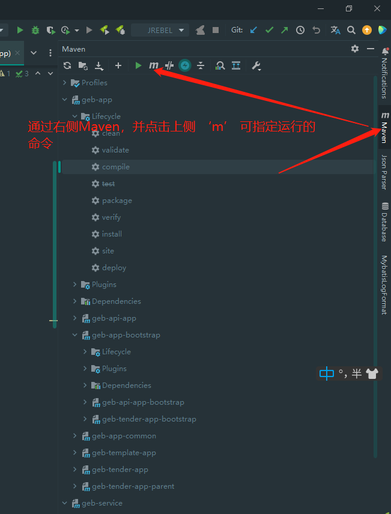
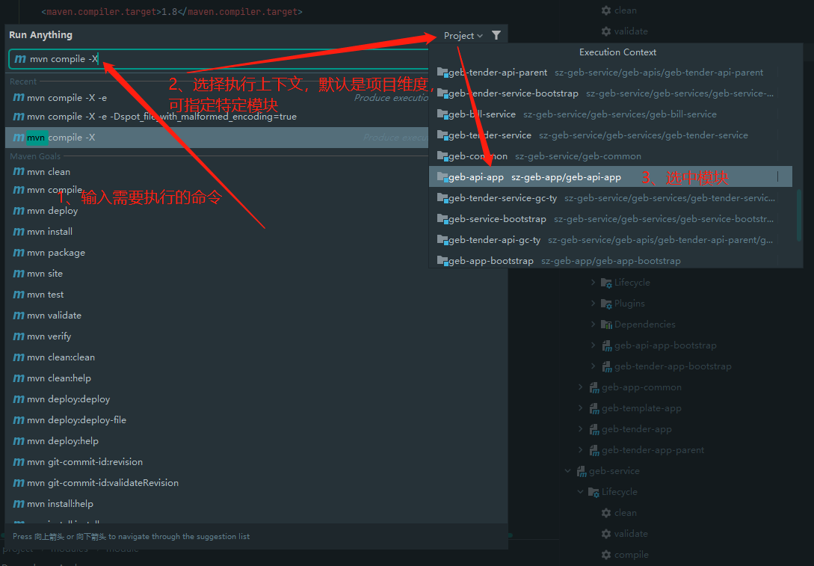
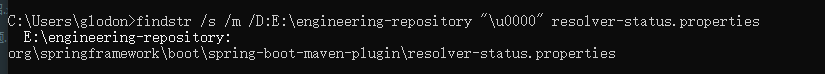

# Maven 报错问题

使用 maven 报错时，可在命令后加上 `-X` 参数，以 `debug` 模式显示详细内容。

在 idea 中，可通过如下方式以特定命令和参数执行 `mvn` 命令：
 - 找到maven项目执行上下文命令行的入口
   
 - 输入命令，并选中模块执行命令 
   
   
## idea debug 调试 maven 编译打包过程
[Maven插件调试方法](https://baijiahao.baidu.com/s?id=1710067999442376558&wfr=spider&for=pc)
[maven-debugging-intellij](https://spin.atomicobject.com/2020/08/20/maven-debugging-intellij/)

## java.lang.IllegalArgumentException: Malformed \uxxxx encoding

### 详细报错内容

```java
[ERROR] Malformed \uxxxx encoding.
java.lang.IllegalArgumentException: Malformed \uxxxx encoding.
    at java.util.Properties.loadConvert (Properties.java:574)
    at java.util.Properties.load0 (Properties.java:391)
    at java.util.Properties.load (Properties.java:341)
    at org.eclipse.aether.internal.impl.TrackingFileManager.read (TrackingFileManager.java:64)
    at org.eclipse.aether.internal.impl.DefaultUpdateCheckManager.read (DefaultUpdateCheckManager.java:511)
    at org.eclipse.aether.internal.impl.DefaultUpdateCheckManager.checkMetadata (DefaultUpdateCheckManager.java:252)
    at org.eclipse.aether.internal.impl.DefaultMetadataResolver.resolve (DefaultMetadataResolver.java:302)
    at org.eclipse.aether.internal.impl.DefaultMetadataResolver.resolveMetadata (DefaultMetadataResolver.java:181)
    at org.apache.maven.repository.internal.DefaultVersionResolver.resolveVersion (DefaultVersionResolver.java:213)
    at org.apache.maven.repository.internal.DefaultArtifactDescriptorReader.loadPom (DefaultArtifactDescriptorReader.java:204)
    at org.apache.maven.repository.internal.DefaultArtifactDescriptorReader.readArtifactDescriptor (DefaultArtifactDescriptorReader.java:171)
    at org.eclipse.aether.internal.impl.collect.DefaultDependencyCollector.resolveCachedArtifactDescriptor (DefaultDependencyCollector.java:541)
    at org.eclipse.aether.internal.impl.collect.DefaultDependencyCollector.getArtifactDescriptorResult (DefaultDependencyCollector.java:524)
    at org.eclipse.aether.internal.impl.collect.DefaultDependencyCollector.processDependency (DefaultDependencyCollector.java:412)
    at org.eclipse.aether.internal.impl.collect.DefaultDependencyCollector.processDependency (DefaultDependencyCollector.java:365)
    at org.eclipse.aether.internal.impl.collect.DefaultDependencyCollector.process (DefaultDependencyCollector.java:352)
    at org.eclipse.aether.internal.impl.collect.DefaultDependencyCollector.doRecurse (DefaultDependencyCollector.java:509)
    at org.eclipse.aether.internal.impl.collect.DefaultDependencyCollector.processDependency (DefaultDependencyCollector.java:461)
    at org.eclipse.aether.internal.impl.collect.DefaultDependencyCollector.processDependency (DefaultDependencyCollector.java:365)
    at org.eclipse.aether.internal.impl.collect.DefaultDependencyCollector.process (DefaultDependencyCollector.java:352)
    at org.eclipse.aether.internal.impl.collect.DefaultDependencyCollector.collectDependencies (DefaultDependencyCollector.java:254)
    at org.eclipse.aether.internal.impl.DefaultRepositorySystem.collectDependencies (DefaultRepositorySystem.java:284)
    at org.apache.maven.project.DefaultProjectDependenciesResolver.resolve (DefaultProjectDependenciesResolver.java:169)
    at org.apache.maven.lifecycle.internal.LifecycleDependencyResolver.getDependencies (LifecycleDependencyResolver.java:243)
    at org.apache.maven.lifecycle.internal.LifecycleDependencyResolver.resolveProjectDependencies (LifecycleDependencyResolver.java:147)
    at org.apache.maven.lifecycle.internal.MojoExecutor.ensureDependenciesAreResolved (MojoExecutor.java:248)
    at org.apache.maven.lifecycle.internal.MojoExecutor.execute (MojoExecutor.java:202)
    at org.apache.maven.lifecycle.internal.MojoExecutor.execute (MojoExecutor.java:156)
    at org.apache.maven.lifecycle.internal.MojoExecutor.execute (MojoExecutor.java:148)
    at org.apache.maven.lifecycle.internal.LifecycleModuleBuilder.buildProject (LifecycleModuleBuilder.java:117)
    at org.apache.maven.lifecycle.internal.LifecycleModuleBuilder.buildProject (LifecycleModuleBuilder.java:81)
    at org.apache.maven.lifecycle.internal.builder.singlethreaded.SingleThreadedBuilder.build (SingleThreadedBuilder.java:56)
    at org.apache.maven.lifecycle.internal.LifecycleStarter.execute (LifecycleStarter.java:128)
    at org.apache.maven.DefaultMaven.doExecute (DefaultMaven.java:305)
    at org.apache.maven.DefaultMaven.doExecute (DefaultMaven.java:192)
    at org.apache.maven.DefaultMaven.execute (DefaultMaven.java:105)
    at org.apache.maven.cli.MavenCli.execute (MavenCli.java:957)
    at org.apache.maven.cli.MavenCli.doMain (MavenCli.java:289)
    at org.apache.maven.cli.MavenCli.main (MavenCli.java:193)
    at sun.reflect.NativeMethodAccessorImpl.invoke0 (Native Method)
    at sun.reflect.NativeMethodAccessorImpl.invoke (NativeMethodAccessorImpl.java:62)
    at sun.reflect.DelegatingMethodAccessorImpl.invoke (DelegatingMethodAccessorImpl.java:43)
    at java.lang.reflect.Method.invoke (Method.java:498)
    at org.codehaus.plexus.classworlds.launcher.Launcher.launchEnhanced (Launcher.java:282)
    at org.codehaus.plexus.classworlds.launcher.Launcher.launch (Launcher.java:225)
    at org.codehaus.plexus.classworlds.launcher.Launcher.mainWithExitCode (Launcher.java:406)
    at org.codehaus.plexus.classworlds.launcher.Launcher.main (Launcher.java:347)
    at org.codehaus.classworlds.Launcher.main (Launcher.java:47)
[ERROR] 

```

### 原因说明
通过报错信息可知，是加载配置文件出现了编码异常问题，一般可能是网络异常导致 maven 下载文件异常，因而触发这个问题，导致 properties 文件解析失败

### 解决办法
#### linux 
若 maven 仓库本地目录是: `~/.m2`
可通过如下命令查找：
```shell
grep -rnw ~/.m2 -e '\u0000'
```
若想同时想删除异常文件，可使用如下命令：
```shell
grep -lrnw ~/.m2 -e '\u0000' | xargs rm
```
也可使用如下命令：
```shell
find  ~/.m2 -name "resolver-status.properties" -print -exec grep "u0" {} \;
```

#### windows
若 maven 仓库本地目录是: `E:\engineering-repository`
可通过如下命令查找：
```shell
findstr /s /m /D:E:\engineering-repository "\u0000" resolver-status.properties
```
查询异常结果类似如下:

文件内容类似如下:
```shell
#NOTE: This is a Maven Resolver internal implementation file, its format can be changed without prior notice.
#Mon Jul 11 19:09:27 CST 2022
maven-metadata-alimaven.xml.lastUpdated=1657505984609
maven-metadata-xxx.xml.error=Could not transfer metadata org.springframework.boot\:spring-boot-maven-plugin/maven-metadata.xml from/to xxx (https\://xyz.com/artifactory/xxx)\: authentication failed for https\://xyz.com/artifactory/xxx/org/springframework/boot/spring-boot-maven-plugin/maven-metadata.xml, st\u0000\u0000\u0000\u0000\u0000\u0000\u0000\u0000\u0000\u0000\u0000\u0000\u0000\u0000\u0000\u0000\u0000\u0000\u0000\u0000\u0000\u0000\u0000\u0000\u0000\u0000\u0000\u0000\u0000\u0000\u0000\u0000\u0000\u0000\u0000\u0000\u0000\u0000\u0000\u0000\u0000\u0000\u0000\u0000\u0000\u0000\u0000\u0000\u0000\u0000\u0000\u0000\u0000\u0000\u0000\u0000\u0000\u0000\u0000\u0000\u0000\u0000\u0000\u0000\u0000\u0000\u0000\u0000\u0000\u0000\u0000\u0000\u0000\u0000\u0000\u0000\u0000\u0000\u0000\u0000\u0000\u0000\u0000\u0000\u0000\u0000\u0000\u0000\u0000\u0000\u0000\u0000\u0000\u0000\u0000\u0000\u0000\u0000\u0000\u0000\u0000\u0000\u0000\u0000\u0000\u0000\u0000\u0000\u0000\u0000\u0000\u0000\u0000\u0000\u0000\u0000\u0000\u0000\u0000\u0000\u0000\u0000\u0000\u0000\u0000\u0000\u0000\u0000\u0000\u0000\u0000\u0000\u0000\u0000\u0000\u0000\u0000\u0000\u0000\u0000\u0000\u0000\u0000\u0000\u0000\u0000\u0000\u0000\u0000\u0000\u0000\u0000\u0000\u0000\u0000\u0000\u0000\u0000\u0000\u0000\u0000\u0000\u0000\u0000\u0000\u0000\u0000\u0000\u0000\u0000\u0000\u0000\u0000\u0000\u0000\u0000\u0000\u0000\u0000\u0000\u0000\u0000\u0000\u0000\u0000\u0000\u0000\u0000\u0000\u0000\u0000\u0000\u0000\u0000\u0000\u0000\u0000\u0000\u0000\u0000\u0000\u0000\u0000\u0000\u0000\u0000\u0000\u0000\u0000\u0000\u0000\u0000\u0000\u0000\u0000\u0000\u0000\u0000\u0000\u0000\u0000\u0000\u0000\u0000\u0000\u0000\u0000\u0000\u0000\u0000\u0000\u0000\u0000\u0000\u0000\u0000\u0000\u0000\u0000\u0000\u0000\u0000\u0000\u0000\u0000\u0000\u0000\u0000\u0000\u0000\u0000\u0000\u0000\u0000\u0000\u0000\u0000\u0000\u0000\u0000\u0000\u0000\u0000\u0000\u0000\u0000\u0000\u0000\u0000\u0000\u0000\u0000\u0000\u0000\u0000\u0000\u0000\u0000\u0000\u0000\u0000\u0000\u0000\u0000\u0000\u0000\u0000\u0000\u0000\u0000\u0000\u0000\u0000\u0000\u0000\u0000\u0000\u0000\u0000\u0000\u0000\u0000\u0000\u0000\u0000\u0000\u0000\u0000\u0000\u0000\u0000\u0000\u0000\u0000\u0000\u0000\u0000\u0000\u0000\u0000\u0000\u0000\u0000\u0000\u0000\u0000\u0000\u0000\u0000\u0000\u0000\u0000\u0000\u0000\u0000\u0000\u0000\u0000\u0000\u0000\u0000\u0000\u0000\u0000\u0000\u0000\u0000\u0000\u0000\u0000\u0000\u0000\u0000\u0000\u0000\u0000\u0000\u0000\u0000\u0000\u0000\u0000\u0000\u0000\u0000\u0000\u0000\u0000\u0000\u0000\u0000\u0000\u0000\u0000\u0000\u0000\u0000\u0000\u0000\u0000\u0000\u0000\u0000\u0000\u0000\u0000\u0000\u0000\u0000\u0000\u0000\u0000\u0000\u0000\u0000\u0000\u0000\u0000\u0000\u0000\u0000\u0000\u0000\u0000\u0000\u0000\u0000\u0000\u0000\u0000\u0000\u0000\u0000\u0000\u0000\u0000\u0000\u0000\u0000\u0000\u0000\u0000\u0000\u0000\u0000\u0000\u0000\u0000\u0000\u0000\u0000\u0000\u0000\u0000\u0000\u0000\u0000\u0000\u0000\u0000\u0000\u0000\u0000\u0000\u0000\u0000\u0000\u0000\u0000\u0000\u0000\u0000\u0000\u0000\u0000\u0000\u0000\u0000\u0000\u0000\u0000\u0000\u0000
```
若想同时想删除异常文件，可使用如下命令：
```shell
set rep="E:\engineering-repository" & echo %rep% | findstr ":" > nul && %rep:~1,2% & cd %rep% & for /f "delims==" %i in ('findstr /s /m "\u0000" resolver-status.properties') do del /s %i
```
- `set rep="E:\engineering-repository"` 指定仓库的绝对路径
- `echo %rep% | findstr ":" > nul && %rep:~1,2%` 查询路径是否带了盘符（如：`E:`）；若有则使用 `%rep:~1,2%` 截取盘符(`E:`)，并进入指定磁盘
- `cd %rep%` 切换到仓库根路径
- `for /f "delims==" %i in ('findstr /s /m "\u0000" resolver-status.properties') do del /s %i`
  - `findstr /s /m "\u0000" resolver-status.properties'` 查询当前目录及其子目录中的 `resolver-status.properties` 文件是否有字符串 `\u0000` ，无则不输出任务内容，如有则输出文件相对路径
    > org\springframework\boot\spring-boot-maven-plugin\resolver-status.properties
  - `del /s %i` 删除文件，并输出完整信息
    > 删除文件 - E:\engineering-repository\org\springframework\boot\spring-boot-maven-plugin\resolver-status.properties
- 遍历并删除所有满足条件的文件

### stackoverflow 相关问题
[java-lang-illegalargumentexception-malformed-uxxxx-encoding-while-mvn-install](https://stackoverflow.com/questions/68003423/java-lang-illegalargumentexception-malformed-uxxxx-encoding-while-mvn-install)

