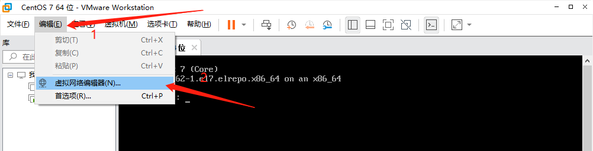
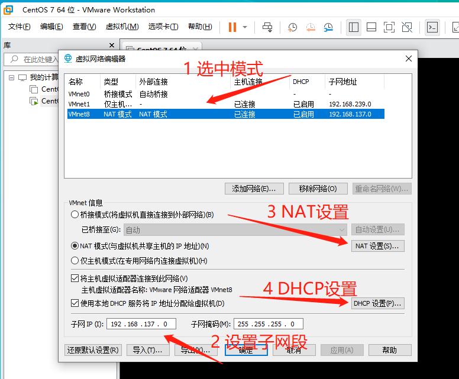
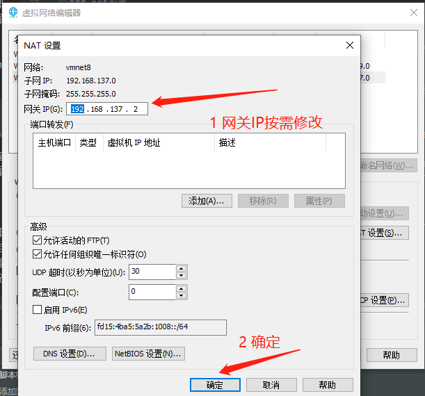
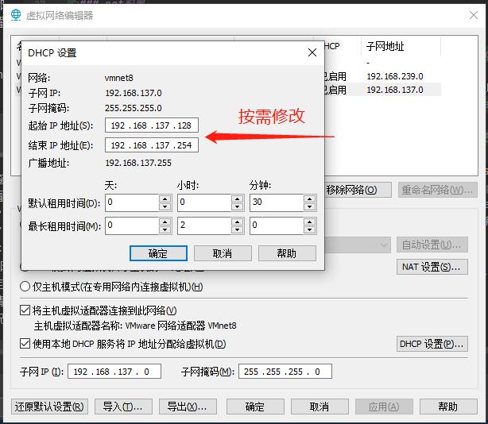
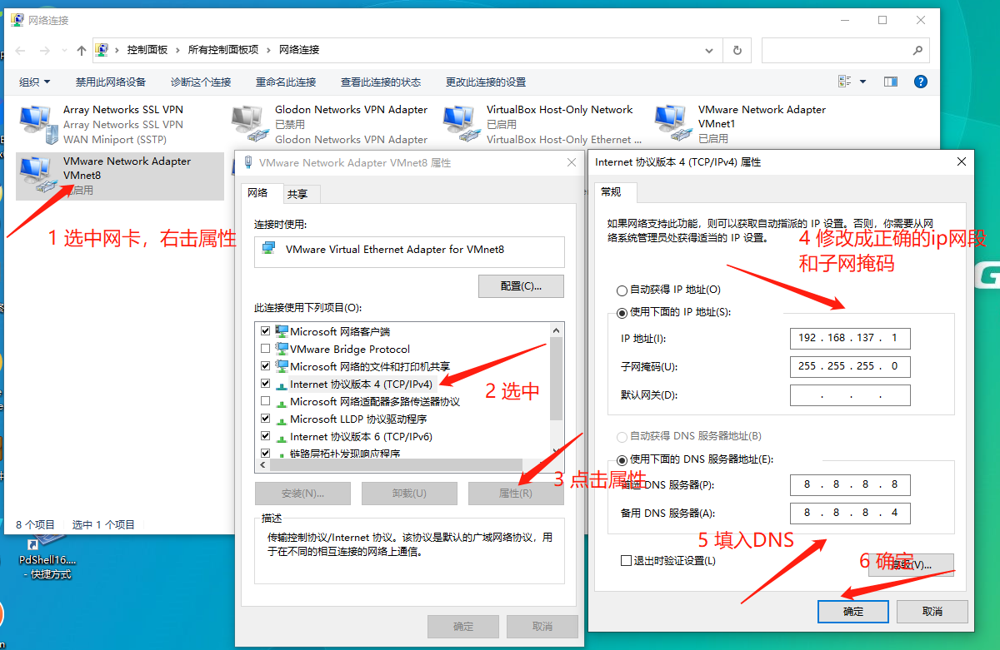

# install-app
各种应用部署安装方式汇总，如：纯手动执行说明脚本+半自动shell脚本+docker方式+k8s方式安装应用


# 各种软件源的配置
参考
    
    http://mirrors.ustc.edu.cn/help/


**注意**：shell.tar.gz 默认解压缩放在/opt目录下，压缩包shell目录中包含了以下shell文件
  * centos7-alibaba-yum.sh 执行后更新 yum 源为阿里 yum 源
  * close_yum-cron.sh 关闭 CentOS 中 yum 自动更新软件功能
  * **log.sh** shell脚本 source 该文件后，可支持各种级别shell日志输出(日志带色彩)，大部分脚本中都有对该文件的引用
  * **purge-win-shell.sh** 执行 /opt/shell/purge-win-shell.sh filename 剔除从 windows 拷贝到 linux 的脚本文件换行符多余的 ^M 字符

# Linux 常见网络问题
[VMware Workstation Pro 16产品文档](https://docs.vmware.com/cn/VMware-Workstation-Pro/16.0/com.vmware.ws.using.doc/GUID-0EE752F8-C159-487A-9159-FE1F646EE4CA.html) 可查看虚拟机网络配置等使用说明
## 首选推荐使用桥接模式
桥接模式的虚拟机可认为是一台和主机隔离的物理机，只要和主机设置成同一个网段（或者同一局域网内可互通的ip即可），
但是针对公司内部限制mac地址上网的方式就不太好了，还需要配置虚拟机的mac地址

## nat模式虚拟机和主机互ping不同问题
nat模式的虚拟机和主机使用的是同一个ip地址，虚拟机对外访问走的还是主机的网络，但是解决了公司内部限制mac地址上网的方式

在配置了 NAT 的路由器上，可以把整个网络分成两部分：内部网络  和 外部网络。

### nat模式原理
NAT（Network Address Translation，网络地址转换），它是一个IETF(Internet Engineering Task Force, Internet工程任务组) 标准，允许一个整体机构以一个公用IP（Internet Protocol）地址出现在Internet上。
它是一种把内部私有网络地址（IP地址）翻译成合法网络IP地址的技术。NAT 可以让那些使用私有地址的内部网络连接到Internet或其它IP网络上。NAT路由器在将内部网络的数据包发送到公用网络时，在IP包的报头把私有地址转换成合法的IP地址。

原理细节可参考: [NAT 详解](https://blog.csdn.net/freeking101/article/details/77962312/)

### nat配置
配置参考: [解决设置了NAT模式之后虚拟机和主机之间仍然ping不通的问题](https://blog.csdn.net/qq_40708079/article/details/118716269)

操作步骤：
- 编辑 -> 虚拟网络编辑器
  
- 进入虚拟网络编辑器，选中 类型值是 `NAT模式` 的 `VMnet8`，按需修改(一般不用修改) `子网IP` 和 `子网掩码`
  
- 进入`NAT设置(S)`，按需修改(一般不用修改) `网关IP(G)`
  
- 进入`DHCP设置(P)`，按需修改(一般不用修改) `起始IP地址(S)` 和 `结束IP地址(E)`
  
- 修改完成后，点击虚拟网络编辑器的 `应用(A)` 按钮 和 `确定` 按钮
- 进入虚拟机，修改ip地址配置文件 `/etc/sysconfig/network-scripts/ifcfg-ens33`，修改后内容大致如下
  ```shell
  TYPE=Ethernet
  PROXY_METHOD=none
  BROWSER_ONLY=no
  # 由dhcp改成none或static，使用静态ip
  BOOTPROTO=none
  DEFROUTE=yes
  IPV4_FAILURE_FATAL=no
  IPV6INIT=yes
  IPV6_AUTOCONF=yes
  IPV6_DEFROUTE=yes
  IPV6_FAILURE_FATAL=no
  IPV6_ADDR_GEN_MODE=stable-privacy
  NAME=ens33
  UUID=db6dcf23-0b7f-4b10-b9ec-6af2d20b9a19
  DEVICE=ens33
  # 改成yes开机启动
  ONBOOT=yes
  # 改成固定的ip，即在子网IP的网段
  IPADDR=192.168.137.128
  # 子网掩码，要与nat设置中的子网掩码保持一致
  PREFIX=255.255.255.0
  # 网关配置，要与nat设置中的网关保持一致
  GATEWAY=192.168.137.2
  # DNS
  DNS1=8.8.8.8
  DNS2=8.8.8.4
  
  ```
- 重启网卡， `systemctl restat network`
- 修改主机的虚拟机网卡`VMware Network Adapter VMnet8` IP信息，在子网IP的网段内，机VMnet8网卡IP要和虚拟机IP在同一网段
  
- 主机和虚拟机互ping，此时应该都是能ping通的，虚拟机 `ping www.baidu.com` 应该也是OK的（不OK重启后，重启后就OK）
- 重启主机和虚拟机！重启主机和虚拟机！重启主机和虚拟机！重要的事情说三遍。再ping应该都是OK的。若不重启可能一开始ping没问题，过一段时间网络又会故障，再怎么修改都没用
  
**总之就一句话**：VMnet8网卡（NAT使用的网卡)ip网段要和虚拟机的网段一致，但ip不要一样，配置完成后重启主机和虚拟机

注意:
- 配置完成后，即使使用命令 `systemctl restart network` 重启网卡，但是 `ping www.baidu.com` 和 `ping 主机ip`仍然可能不通，但是一般主机 `ping 虚拟机ip` 是OK的，此时一般重启一下虚拟机即可
- 最好在调整主机的虚拟机网卡`VMware Network Adapter VMnet8`，尤其是VMware Workstation的`虚拟网络编辑器`调整网络网段后，重启一下虚拟机，要不然很可能导致配置正确，网络仍然ping不通的问题
- 若一开始主机和虚拟机是能互ping成功的，但是过一段时间主机又ping不通虚拟机，但是反向是正常的，那么很可能是主机开了vpn之类的东西，会导致主机ping不通虚拟机（是个大坑）。

### 虚拟机nat模式事故
[虚拟机nat模式事故](./虚拟机nat模式事故.md)


# Linux 服务器同步时间命令

- *ntpdate*立即同步修改服务器时间，与阿里云服务器时间保持同步
```shell script
ntpdate ntp1.aliyun.com
```

- *ntp*平滑同步修改服务器时间
  
# Docker容器指定自定义网段的固定IP/静态IP地址
## 方案一
- 第一步：创建自定义网络

    备注：这里选取了172.172.0.0网段，也可以指定其他任意空闲的网段

        docker network create --subnet=172.172.0.0/16 docker-ice

    注：docker-ice为自定义网桥的名字，可自己任意取名。

- 第二步：在你自定义的网段选取任意IP地址作为你要启动的container的静态IP地址

    备注：这里在第二步中创建的网段中选取了172.172.0.10作为静态IP地址。这里以启动docker-ice为例。

        docker run -d --net docker-ice --ip 172.172.0.10 ubuntu:16.04

## 方案二

  备注1：这里是固定IP地址的一个应用场景的延续，仅作记录用。
  
  备注2：如果需要将指定IP地址的容器出去的请求的源地址改为宿主机上的其他可路由IP地址，可用iptables来实现。比如将静态
  
  **注意**：docker默认网段是 172.17.0.0/16
  
  IP地址 172.18.0.10出去的请求的源地址改成公网IP104.232.36.109(前提是本机存在这个IP地址)，可执行如下命令：

    iptables -t nat -I POSTROUTING -o eth0 -d  0.0.0.0/0 -s 172.18.0.10  -j SNAT --to-source 104.232.36.109
    
# Linux Tips

## Linux 脚本

### 脚本中的 `set -e` 和 `set +e` 及其他选项
- **`set -e`** ： 执行的时候如果出现了返回值为非零，整个脚本 就会立即退出 
- **`set +e`**： 执行的时候如果出现了返回值为非零将会继续执行下面的脚本 

| 选项名 | 快捷开关 | 含义 |
| ---- | --- | ---- |		
| allexport | -a | 从这个选项中被设置开始就自动标明要输出的新变量或修改过的变量，直至选项被复位 |
| braceexpand | -B | 打开花括号扩展，它是一个默认设置 |
| emacs | | 使用emacs内置编辑器进行命令行编辑，是一个默认设置 |
| errexit | -e | 当命令返回一个非零退出状态（失败）时退出。读取初始化文件时不设置 |
| histexpand | -H | 执行历史替换时打开!和!!扩展，是一个默认设置 |
| history | | 打开命令行历史、默认为打开 |
| ignoreeof	| | 禁止用EOF(Ctrl+D)键退出shell。必须键入exit才能退出。等价于设置shell变量IGNOREEOF=10 |
| keyword | -k | 将关键字参数放到命令的环境中 |
| interactive-comments | | 对于交互式shell，把#符后面的文本作为注释 |
| monitor | -m | 设置作业控制 |
| noclobber	| -C | 防止文件在重定向时被重写 |
| noexec | -n | 读命令，但不执行。用来检查脚本的语法。交互式运行时不开启 |
| noglob | -d | 禁止用路径名扩展。即关闭通配符 |
| notify | -b | 后台作业完成时通知用户 |
| nounset | -u | 扩展一个未设置的变量时显示一个错误信息 |
| onecmd | -t |在读取和执行命令后退出 |
| physical | -P |设置时，在键入cd或pwd禁止符号链接。用物理目录代替 |
| privileged | -p |设置后，shell不读取.profile或ENV文件，且不从环境继承shell函数，将自动为setuid脚本开启特权 |
| verbose | -v 	为调试打开verbose模式 |
| vi | | 使用vi内置编辑器进行命令行编辑 |
| xtrace | -x | 为调试打开echo模式 |

### 基于上一个命令结果，执行其他命令
```
if [ "$?"-ne 0]; then echo "command failed"; exit 1; fi
```
可以替换成： 
```
command ||  echo "command failed"; exit 1; （这种写法并不严谨，我当时的场景是执行ssh "commond"，
所以可以返回退出码后面通过[ #？ -eq 0 ]来做判断，如果是在shell中无论成功还是失败都会exit）
command || (echo "command failed"; exit 1);
```
或者使用： 
```
if ! command; then echo "command failed"; exit 1; fi
```

      