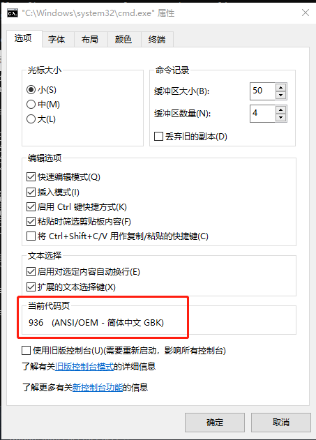
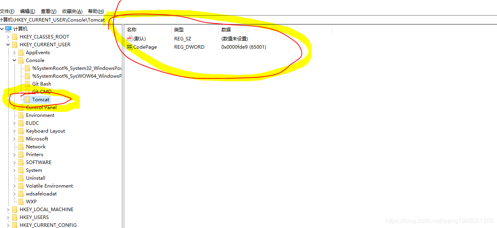

# Windows Tomcat 控制台UTF-8乱码问题

## 乱码原因
Tomcat命令窗口字符编码（GBK）与显示的字符编码（UTF-8）不匹配。
可打开 cmd 控制台，右击控制台，查看对应 `属性` 中的 `当前代码页` 可知默认字符编码，类似如下图


## 常见场景
Windows 中 Tomcat 命令窗口默认字符编码（GBK）与应用显示需要的字符编码（UTF-8）不匹配。
即需要在 `%CATALINA_HOME%\bin\catalina.bat` 的 `JAVA_OPTS` 变量值中加入 `-Dfile.encoding=UTF-8`
如：activit 的 editor 需要 Tomcat 启动时需要加上 `-Dfile.encoding=UTF-8` 参数，否则绘制的流程图部署时会出现乱码

## 解决方法
### 方案一：通过注册表修改Tomcat命令窗口的默认字符编码为UTF-8即可解决
第一步：`Windows+R` 打开运行，输入 `regedit` 进入注册表编辑器

第二步：在 `HKEY_CURRENT_USER/Console/Tomcat` 中修改CodePage为十进制的65001

注意：如果没有Tomcat或者CodePage，直接新建一个
- 右键 Console -> 新建 -> 项 ，输入 Tomcat
- 右键 Tomcat -> 新建 -> DWORD（32位） 值（D），输入16进制 `fde9` ，就是十进制的 `65001`，也可输入值后，通过修改值为十进制的 65001

最终如下图所示


### 方案二：修改 %CATALINA_HOME%\bin\catalina.bat 启动脚本
将原始
```shell
set _EXECJAVA=start "%TITLE%" %_RUNJAVA%
```
修改成
```shell
rem 声明使用utf-8编码 防止控制台乱码
chcp 65001
rem 使用 /b 使用当前窗口，使用当前窗口的环境变量，主要是字符编码
set _EXECJAVA=start "%TITLE%" /b %_RUNJAVA%
```
