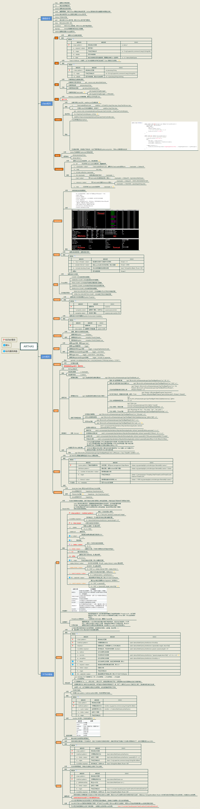
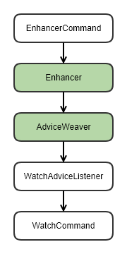

# Java 诊断神器Arthas

遇到线上Java应用的问题，我们通常是使用哪些工具，以及怎么定位和处理问题的，常见的Java应用的问题又有哪些呢？

## 常见的JVM故障

- 死锁
- CPU过高
- 内存溢出
- 栈溢出
- 资源泄露
- 等等

## 常用的Java诊断工具

### jdk自带

- jps
- jvisualvm
- jstack
- jstat
- jconsole
- jmap
- jhat
- jinfo
- 等等

### 其他诊断工具

### 示例：死锁问题定位和解决步骤

1. 启动死锁的进程服务

   ```
   $ java -jar java -jar deadlock-demo-0.0.1.jar
   Thread-0: prepare lock A
   Thread-0: fetched lock A
   main: prepare lock B
   main: fetched lock B
   main: prepare lock A
   Thread-0: prepare lock B
   ```

   

2. 使用 **jps** 找到异常的进程

   ```
   $ jps
   18848 Deadlock
   18932 RemoteMavenServer36
   4852 Bootstrap
   7620
   19912 Launcher
   7688 Jps
   21276 Launcher
   ```

   以上异常进程ID是 `18848`

3. 使用 **jstack** 定位异常

   ```
   $ jstack -l 18848
   ...
   Found one Java-level deadlock:
   =============================
   "Thread-0":
     waiting to lock monitor 0x00007fc2e80062c8 (object 0x00000000d3ee74b0, a java.lang.Object),
     which is held by "main"
   "main":
     waiting to lock monitor 0x00007fc2e8004cc8 (object 0x00000000d3ee74c0, a java.lang.Object),
     which is held by "Thread-0"
   
   Java stack information for the threads listed above:
   ===================================================
   "Thread-0":
           at Deadlock.lockBA(Deadlock.java:25)
           - waiting to lock <0x00000000d3ee74b0> (a java.lang.Object)
           at Deadlock.lambda$null$1(Deadlock.java:40)
           at Deadlock$$Lambda$3/796250032.accept(Unknown Source)
           at Deadlock.lockAB(Deadlock.java:17)
           - locked <0x00000000d3ee74c0> (a java.lang.Object)
           at Deadlock.lambda$main$2(Deadlock.java:40)
           at Deadlock$$Lambda$1/142257191.run(Unknown Source)
           at java.lang.Thread.run(Thread.java:748)
   "main":
           at Deadlock.lockAB(Deadlock.java:11)
           - waiting to lock <0x00000000d3ee74c0> (a java.lang.Object)
           at Deadlock.lambda$main$4(Deadlock.java:42)
           at Deadlock$$Lambda$2/1406718218.accept(Unknown Source)
           at Deadlock.lockBA(Deadlock.java:31)
           - locked <0x00000000d3ee74b0> (a java.lang.Object)
           at Deadlock.main(Deadlock.java:42)
   
   Found 1 deadlock.
   ```

4. 分析并定位异常的代码行和方法

   由上诉的死锁信息可知，

   - **Thread-1** 等待一个被 **Thread-0** 持有的锁，异常代码行在 `Deadlock.lockAB(Deadlock.java:13)`
   - 同时 **Thread-0** 等待一个被 **Thread-1** 持有的锁，异常代码行在 `Deadlock.lockBA(Deadlock.java:27)`


遇到上面的问题我们可以用jstack进行定位处理；要是遇到内存问题，则需要使用jmap和jhat处理；通常我们还会遇到一些并发问题，服务重启就好了，以及我的代码为什么没有执行，是代码没打包上去吗，为什么那行代码就是没执行，我测试运行正常，怎么上线就异常了等等问题，这时候我们会想，要是我们能线上debug，JUnit的方法测试就好了


## 为什么使用Arthas

Arthas 是Alibaba开源的Java诊断工具，深受开发者喜爱。

当你遇到以下类似问题而束手无策时，Arthas可以帮助你解决：

1. 这个类从哪个 jar 包加载的？为什么会报各种类相关的 Exception？
2. 我改的代码为什么没有执行到？难道是我没 commit？分支搞错了？
3. 遇到问题无法在线上 debug，难道只能通过加日志再重新发布吗？
4. 线上遇到某个用户的数据处理有问题，但线上同样无法 debug，线下无法重现！
5. 是否有一个全局视角来查看系统的运行状况？
6. 有什么办法可以监控到JVM的实时运行状态？
7. 怎么快速定位应用的热点，生成火焰图？
8. 怎样直接从JVM内查找某个类的实例？

Arthas支持JDK 6+，支持Linux/Mac/Windows，采用命令行交互模式，同时提供丰富的 Tab 自动补全功能，进一步方便进行问题的定位和诊断。


### Arthas 相关网站

- [Arthas GitHub 网址](https://github.com/alibaba/arthas)
- [Arthas 中文官网地址](https://arthas.aliyun.com/zh-cn/) （更多命令和使用细节可查看该网址）
- [Arthas Idea 插件](https://www.yuque.com/arthas-idea-plugin/help/pe6i45)


### 最好能了解的其他内容

- **OGNL** -- **对象导航图语言**（Object Graph Navigation Language） 官方指南参考:

  [https://commons.apache.org/proper/commons-ognl/language-guide.html]: https://commons.apache.org/proper/commons-ognl/language-guide.html	"OGNL 官方指南"

- **OGNL** 特殊用法请参考：

  [https://github.com/alibaba/arthas/issues/71]: https://github.com/alibaba/arthas/issues/71	"特殊用法"


### 注意事项

- 由于Arthas需要依赖jdk的 `dt.jar` 和 `tools.jar` 包，若java环境只使用了jre，那个Arthas无法使用。如：使用openjre打包的Docker镜像会有问题，需要使用openjdk镜像

  ```
  [ERROR] Start arthas failed, exception stack trace:
  com.sun.tools.attach.AttachNotSupportedException: Unable to get pid of LinuxThreads manager thread
  ```

  

- 为什么在windows我的JDK环境变量配置的没有问题，但是在命令行启动jar包和使用Arthas的mc等命令总是提示如下内容呢？

  ```
  $ mc MathGame.java
  Memory compiler error, exception message: Can not load JavaCompiler from javax.tools.ToolProvider#getSystemJavaCompiler(), please confirm the application running in JDK not JRE., please check $HOME/logs/arthas/arthas.log for more details.
  ```

  正如 Arthas 提示所说，确实用的是jre。不信可使用 git bash 执行命令看结果:

  ```
  $ which java
  /c/Program Files (x86)/Common Files/Oracle/Java/javapath/java
  ```

  出现此问题是因为，[java](https://www.seotest.cn/wenzhang/java/)自动更新后自动配置了path：C:\Program Files (x86)\Common Files\[oracle](https://www.seotest.cn/wenzhang/oracle/)\Java\javapath。这导致我们配置的jdk不被优先使用，所以找不到。

  解决方法（两种）：

  **1、删掉C:\Program Files (x86)\Common Files\Oracle\Java\javapath目录下的文件**

  **2、将%JAVA_HOME%\bin;%JAVA_HOME%\jre\bin放在path的最前面**

- 多个 `arthas` 同时连接多个不同应用，如果不做任何特殊处理会出现如下报错信息:

  ```
  java -jar arthas-boot.jar
  [INFO] arthas-boot version: 3.4.3
  [INFO] Process 43980 already using port 3658
  [INFO] Process 43980 already using port 8563
  [INFO] Found existing java process, please choose one and input the serial number of the process, eg : 1. Then hit ENTER.
  * [1]: 43980 arthas-demo.jar
    [2]: 14736
    [3]: 21888 arthas-boot.jar
    [4]: 36164 demo-arthas-spring-boot.jar
    [5]: 11816 org.jetbrains.jps.cmdline.Launcher
  4
  [ERROR] The telnet port 3658 is used by process 43980 instead of target process 36164, you will connect to an unexpected process.
  [ERROR] 1. Try to restart arthas-boot, select process 43980, shutdown it first with running the 'stop' command.
  [ERROR] 2. Or try to stop the existing arthas instance: java -jar arthas-client.jar 127.0.0.1 3658 -c "stop"
  [ERROR] 3. Or try to use different telnet port, for example: java -jar arthas-boot.jar --telnet-port 9998 --http-port -1
  ```

  此时提示 telnet 的端口和 http 端口已经被占用了，需要额外指定：

  `java -jar arthas-boot.jar --telnet-port 4658 --http-port 8564`

  

## Arthas常用命令说明

### JVM相关命令

| 命令        | 说明                                                         |
| ----------- | ------------------------------------------------------------ |
| dashboard   | 当前系统的实时数据面板                                       |
| thread      | 查看当前线程信息，查看线程的堆栈                             |
| jvm         | 查看当前 JVM 的信息                                          |
| sysprop     | 查看当前JVM的系统属性(`System Property`)                     |
| sysenv      | 查看当前JVM的环境属性(`System Environment Variables`)        |
| vmoption    | 查看，更新VM诊断相关的参数                                   |
| prefcounter | 查看当前JVM的 Perf Counter信息                               |
| logger      | 查看logger信息，更新logger level                             |
| getstatic   | 查看类的静态属性。                                           |
| ognl        | 执行ognl表达式                                               |
| mbean       | 查看 Mbean 的信息，这个命令可以便捷的查看或监控 Mbean 的属性信息。 |
| heapdump    | dump java heap, 类似jmap命令的heap dump功能。                |

### 类命令

| 命令        | 说明                                                         |
| ----------- | ------------------------------------------------------------ |
| sc          | 查看JVM已加载的类信息                                        |
| sm          | 查看已加载类的方法信息                                       |
| jad         | 反编译指定已加载类的源码                                     |
| classloader | 查看classloader的继承树，urls，类加载信息。使用classloader去getResource |
| dump        | dump 已加载类的 bytecode 到特定目录                          |
| mc          | Memory Compiler/内存编译器，编译`.java`文件生成`.class`      |
| redefine    | 加载外部的`.class`文件，redefine jvm已加载的类               |

### 增强命令

| 命令     | 说明                                                         |
| -------- | ------------------------------------------------------------ |
| monitor  | 方法执行监控                                                 |
| watch    | 方法执行数据观测                                             |
| trace    | 方法内部调用路径，并输出方法路径上的每个节点上耗时           |
| stack    | 输出当前方法被调用的调用路径                                 |
| tt       | 方法执行数据的时空隧道，记录下指定方法每次调用的入参和返回信息，并能对这些不同的时间下调用进行观测 |
| profiler | 生成应用热点的火焰图。本质上是通过不断的采样，然后把收集到的采样结果生成火焰图。 |

### Arthas 命令汇总图




## Arthas 常用命令示例

### SC

- 查找类: `sc -d *UserController`
- 查找类加载器: `sc -d *UserController | grep classLoaderClass`

### jad/mc/retransform

- 反编译类到本地: `jad --source-only com.example.demo.arthas.user.UserController > UserController.java`
- 使用指定类的类加载器编译类: `mc -c 38af3868 UserController.java -d D:\opt\arthas`
- 使用`retransform`命令重新加载新编译的类: `retransform  "D:\opt\arthas\com\example\demo\arthas\user\UserController.class"`

### 日志相关

- 查看类的日志级别logger -n com.example.demo.arthas.user.UserController


## 安装启动

#### 快速安装 `arthas-boot`（推荐）

1. 在一个目录下下载`arthas-boot.jar`

- Linux/Unix/Mac 方式命令行下载：

```
curl -O https://arthas.aliyun.com/arthas-boot.jar
```

- Windows 方式下载：访问 https://arthas.aliyun.com/arthas-boot.jar，即可直接在浏览器下载。


1. 然后用`java -jar`的方式启动：

```
java -jar -Dfile.encoding=utf-8 arthas-boot.jar
```

**注意：**首次启动 `arthas-boot.jar` 会对应的在 `user home` 下生成 arthas 的相关目录并下载依赖包：

- Linux/Unix/Mac 平台 `~/.arthas/`和`~/logs/arthas`目录
- Windows平台 user home下面的`.arthas`和`logs/arthas`目录
- 如果下载速度比较慢，可以使用aliyun的镜像：

```
java -jar arthas-boot.jar --repo-mirror aliyun --use-http
```

- 只需删除对应目录就卸载了 Arthas


1. 打印帮助信息：

```
java -jar arthas-boot.jar -h
```


## 快速入门

### 启动Demo

`arthas-demo`是一个简单的程序，每隔一秒生成一个随机数，再执行质因数分解，并打印出分解结果。

在相同目录下下载 `arthas-demo`

```
curl -O https://arthas.aliyun.com/arthas-demo.jar
java -jar arthas-demo.jar
```

或者点击链接下载 https://arthas.aliyun.com/arthas-demo.jar 再启动。`arthas-demo`

### 启动arthas

```
java -jar arthas-boot.jar
```

选择应用java进程：

```
$ $ java -jar arthas-boot.jar
* [1]: 35542
  [2]: 71560 arthas-demo.jar
```

Demo进程是第2个，则输入2，再输入`回车/enter`。Arthas会attach到目标进程上，并输出日志：

```
[INFO] Try to attach process 71560
[INFO] Attach process 71560 success.
[INFO] arthas-client connect 127.0.0.1 3658
  ,---.  ,------. ,--------.,--.  ,--.  ,---.   ,---.
 /  O  \ |  .--. ''--.  .--'|  '--'  | /  O  \ '   .-'
|  .-.  ||  '--'.'   |  |   |  .--.  ||  .-.  |`.  `-.
|  | |  ||  |\  \    |  |   |  |  |  ||  | |  |.-'    |
`--' `--'`--' '--'   `--'   `--'  `--'`--' `--'`-----'
 
wiki: https://arthas.aliyun.com/doc
version: 3.0.5.20181127201536
pid: 71560
time: 2018-11-28 19:16:24
 
$
```

### 指定进程启动arthas

```
java -jar arthas-boot.jar <PID>
```


### 通过浏览器页面访问（不推荐）

Arthas支持通过Web Socket来连接。当在本地启动时，可以访问 [http://127.0.0.1:8563/ ](http://127.0.0.1:8563/) ，通过浏览器来使用Arthas。


### 使用help查看Arthas命令

```
$ help
help
 NAME         DESCRIPTION
 help         Display Arthas Help
 keymap       Display all the available keymap for the specified connection.
 sc           Search all the classes loaded by JVM
 sm           Search the method of classes loaded by JVM
 classloader  Show classloader info
 jad          Decompile class
 getstatic    Show the static field of a class
 monitor      Monitor method execution statistics, e.g. total/success/failure
              count, average rt, fail rate, etc.
 stack        Display the stack trace for the specified class and method
 thread       Display thread info, thread stack
 trace        Trace the execution time of specified method invocation.
 watch        Display the input/output parameter, return object, and thrown ex
              ception of specified method invocation
 tt           Time Tunnel
 jvm          Display the target JVM information
 perfcounter  Display the perf counter information.
 ognl         Execute ognl expression.
 mc           Memory compiler, compiles java files into bytecode and class fil
              es in memory.
 redefine     Redefine classes. @see Instrumentation#redefineClasses(ClassDefi
              nition...)
 dashboard    Overview of target jvm\'s thread, memory, gc, vm, tomcat info.
 dump         Dump class byte array from JVM
 heapdump     Heap dump
 options      View and change various Arthas options
 cls          Clear the screen
 reset        Reset all the enhanced classes
 version      Display Arthas version
 session      Display current session information
 sysprop      Display, and change the system properties.
 sysenv       Display the system env.
 vmoption     Display, and update the vm diagnostic options.
 logger       Print logger info, and update the logger level
 history      Display command history
 cat          Concatenate and print files
 echo         write arguments to the standard output
 pwd          Return working directory name
 mbean        Display the mbean information
 grep         grep command for pipes.
 tee          tee command for pipes.
 profiler     Async Profiler. https://github.com/jvm-profiling-tools/async-pro
              filer
 stop         Stop/Shutdown Arthas server and exit the console.
 
$
```


### 查看dashboard

输入[dashboard](https://arthas.aliyun.com/doc/dashboard.html)，按`回车/enter`，会展示当前进程的信息，按`ctrl+c`可以中断执行。

```
$ dashboard
ID   NAME                          GROUP          PRIORITY  STATE    %CPU      DELTA_TIM TIME      INTERRUPT DAEMON
-1   C2 CompilerThread7            -              -1        -        0.0       0.000     0:1.109   false     true
141  arthas-command-execute        system         5         TIMED_WA 0.0       0.000     0:1.046   false     true
-1   C2 CompilerThread2            -              -1        -        0.0       0.000     0:0.984   false     true
-1   C2 CompilerThread6            -              -1        -        0.0       0.000     0:0.953   false     true
-1   C2 CompilerThread0            -              -1        -        0.0       0.000     0:0.906   false     true
-1   C2 CompilerThread5            -              -1        -        0.0       0.000     0:0.875   false     true
-1   C2 CompilerThread1            -              -1        -        0.0       0.000     0:0.812   false     true
-1   C2 CompilerThread3            -              -1        -        0.0       0.000     0:0.671   false     true
-1   C2 CompilerThread4            -              -1        -        0.0       0.000     0:0.625   false     true
-1   C1 CompilerThread10           -              -1        -        0.0       0.000     0:0.562   false     true
-1   C1 CompilerThread9            -              -1        -        0.0       0.000     0:0.515   false     true
Memory                    used    total    max     usage    GC
heap                      79M     170M     3630M   2.18%    gc.ps_scavenge.count          8
ps_eden_space             35M     56M      1309M   2.74%    gc.ps_scavenge.time(ms)       63
ps_survivor_space         22M     25M      25M     91.09%   gc.ps_marksweep.count         1
ps_old_gen                20M     89M      2723M   0.75%    gc.ps_marksweep.time(ms)      25
nonheap                   44M     51M      -1      87.01%
code_cache                9M      15M      240M    3.84%
metaspace                 31M     32M      -1      98.08%
compressed_class_space    3M      4M       1024M   0.39%
Runtime
os.name                                                     Windows 10
os.version                                                  10.0
java.version                                                1.8.0_191
java.home                                                   D:\work\Java\jre1.8.0_191
systemload.average                                          -1.00
processors                                                  16
uptime                                                      8506s
```


### 通过thread命令来获取到`arthas-demo`进程的Main Class

`thread 1`会打印线程ID 1的栈，通常是main函数的线程。

```
$ thread 1 | grep 'main('
    at demo.MathGame.main(MathGame.java:17)
```


### 通过jad来反编译Main Class

```
$ jad demo.MathGame

ClassLoader:
+-sun.misc.Launcher$AppClassLoader@5c647e05
  +-sun.misc.Launcher$ExtClassLoader@28d93b30

Location:
/D:/opt/arthas/arthas-demo.jar

/*
 * Decompiled with CFR.
 */
package demo;

import java.util.ArrayList;
import java.util.List;
import java.util.Random;
import java.util.concurrent.TimeUnit;

public class MathGame {
    private static Random random = new Random();
    public int illegalArgumentCount = 0;

    public static void main(String[] args) throws InterruptedException {
        MathGame game = new MathGame();
        while (true) {
            game.run();
            TimeUnit.SECONDS.sleep(1L);
        }
    }

    public void run() throws InterruptedException {
        try {
            int number = random.nextInt() / 10000;
            List<Integer> primeFactors = this.primeFactors(number);
            MathGame.print(number, primeFactors);
        }
        catch (Exception e) {
            System.out.println(String.format("illegalArgumentCount:%3d, ", this.illegalArgumentCount) + e.getMessage());
        }
    }

    public static void print(int number, List<Integer> primeFactors) {
        StringBuffer sb = new StringBuffer(number + "=");
        for (int factor : primeFactors) {
            sb.append(factor).append('*');
        }
        if (sb.charAt(sb.length() - 1) == '*') {
            sb.deleteCharAt(sb.length() - 1);
        }
        System.out.println(sb);
    }

    public List<Integer> primeFactors(int number) {
        if (number < 2) {
            ++this.illegalArgumentCount;
            throw new IllegalArgumentException("number is: " + number + ", need >= 2");
        }
        ArrayList<Integer> result = new ArrayList<Integer>();
        int i = 2;
        while (i <= number) {
            if (number % i == 0) {
                result.add(i);
                number /= i;
                i = 2;
                continue;
            }
            ++i;
        }
        return result;
    }
}

Affect(row-cnt:1) cost in 111 ms.
```

**注意**：若是只想看反编译后的源码信息，一般会带上选项 `--source-only` ，也可将源码输出到特定文件中方便后续的修改

```
$ jad --source-only demo.MathGame > MathGame.java
```

**注意**：也可在类后面指定方法名，查看特定方法的源码

```
$ jad --source-only demo.MathGame primeFactors 
```


### watch 方法调用

通过阅读源码可知道`primeFactors`是其核心方法，通过[watch](https://arthas.aliyun.com/doc/watch.html)命令来观察`demo.MathGame#primeFactors`函数的返回值：

```
$ watch demo.MathGame primeFactors returnObj
Press Q or Ctrl+C to abort.
Affect(class count: 1 , method count: 1) cost in 98 ms, listenerId: 1
ts=2020-10-12 14:01:58; [cost=0.5483ms] result=@ArrayList[
    @Integer[3],
    @Integer[11],
    @Integer[19],
    @Integer[277],
]
ts=2020-10-12 14:01:59; [cost=0.2293ms] result=@ArrayList[
    @Integer[2],
    @Integer[2],
    @Integer[2],
    @Integer[2],
    @Integer[7907],
]
ts=2020-10-12 14:02:00; [cost=1.5803ms] result=@ArrayList[
    @Integer[2],
    @Integer[100483],
]
```

**注意**：[watch](https://arthas.aliyun.com/doc/watch.html)命令是一个常用的命令，我们不仅可以查看方法的返回值（returnObj），还可以查看到入参（params）、抛出的异常(throwExp)、调用对象（target）、类对象（clazz）、方法对象（method）。

**特别说明**：

- watch 命令定义了4个观察事件点，即 `-b` 方法调用前，`-e` 方法异常后，`-s` 方法返回后，`-f` 方法结束后
- 4个观察事件点 `-b`、`-e`、`-s` 默认关闭，`-f` 默认打开，当指定观察点被打开后，在相应事件点会对观察表达式进行求值并输出
- 这里要注意`方法入参`和`方法出参`的区别，有可能在中间被修改导致前后不一致，除了 `-b` 事件点 `params` 代表方法入参外，其余事件都代表方法出参
- 当使用 `-b` 时，由于观察事件点是在方法调用前，此时返回值或异常均不存在

有一个问题需要注意一下：就是[watch](https://arthas.aliyun.com/doc/watch.html)命令默认（`-f` 方法结束后）观察的入参（params）若是在方法内部值被修改了，此时获取的值是修改后的值，不是初始的入参值。

常用示例：

```
 $ watch demo.MathGame primeFactors '{params[0], returnObj,throwExp}' -x 2
```


### 退出arthas

如果只是退出当前的连接，可以用`quit`或者`exit`命令。Attach到目标进程上的arthas还会继续运行，端口会保持开放，下次连接时可以直接连接上。

如果想完全退出arthas，可以执行`stop`命令。

#### 释放已存在的 arthas 连接

##### 方案一：

使用telnet，连接上已存在的session，再使用stop命令停止

```
telnet 127.0.0.1 3658
stop
```


##### 方案二：

arthas-client.jar 在 arthas-boot.jar 启动时会被下载到本地，通常在 ``~/.arthas/lib/<version>/arthas/arthas-client.jar``

```
java -jar arthas-client.jar 127.0.0.1 3658 -c "stop"
```


## 表达式核心变量

https://arthas.aliyun.com/doc/advice-class.html

无论是匹配表达式也好、观察表达式也罢，他们核心判断变量都是围绕着一个 Arthas 中的通用通知对象 `Advice` 进行。

它的简略代码结构如下

```
public class Advice {
 
    private final ClassLoader loader;
    private final Class<?> clazz;
    private final ArthasMethod method;
    private final Object target;
    private final Object[] params;
    private final Object returnObj;
    private final Throwable throwExp;
    private final boolean isBefore;
    private final boolean isThrow;
    private final boolean isReturn;
    
    // getter/setter  
}  
```

这里列一个表格来说明不同变量的含义

| 变量名    | 变量解释                                                     |
| --------- | ------------------------------------------------------------ |
| loader    | 本次调用类所在的 ClassLoader                                 |
| clazz     | 本次调用类的 Class 引用                                      |
| method    | 本次调用方法反射引用                                         |
| target    | 本次调用类的实例                                             |
| params    | 本次调用参数列表，这是一个数组，如果方法是无参方法则为空数组 |
| returnObj | 本次调用返回的对象。当且仅当 `isReturn==true` 成立时候有效，表明方法调用是以正常返回的方式结束。如果当前方法无返回值 `void`，则值为 null |
| throwExp  | 本次调用抛出的异常。当且仅当 `isThrow==true` 成立时有效，表明方法调用是以抛出异常的方式结束。 |
| isBefore  | 辅助判断标记，当前的通知节点有可能是在方法一开始就通知，此时 `isBefore==true` 成立，同时 `isThrow==false` 和 `isReturn==false`，因为在方法刚开始时，还无法确定方法调用将会如何结束。 |
| isThrow   | 辅助判断标记，当前的方法调用以抛异常的形式结束。             |
| isReturn  | 辅助判断标记，当前的方法调用以正常返回的形式结束。           |

所有变量都可以在表达式中直接使用，如果在表达式中编写了不符合 OGNL 脚本语法或者引入了不在表格中的变量，则退出命令的执行；用户可以根据当前的异常信息修正`条件表达式`或`观察表达式`

- 特殊用法请参考：https://github.com/alibaba/arthas/issues/71
- OGNL表达式官网：https://commons.apache.org/proper/commons-ognl/language-guide.html


## [特殊用法请参考](https://github.com/alibaba/arthas/issues/71)


## vmtool 

`vmtool` 利用`JVMTI`接口，实现查询内存对象，强制GC等功能。

### 获取对象

```
$ vmtool --action getInstances --className java.lang.String --limit 10
@String[][
    @String[com/taobao/arthas/core/shell/session/Session],
    @String[com.taobao.arthas.core.shell.session.Session],
    @String[com/taobao/arthas/core/shell/session/Session],
    @String[com/taobao/arthas/core/shell/session/Session],
    @String[com/taobao/arthas/core/shell/session/Session.class],
    @String[com/taobao/arthas/core/shell/session/Session.class],
    @String[com/taobao/arthas/core/shell/session/Session.class],
    @String[com/],
    @String[java/util/concurrent/ConcurrentHashMap$ValueIterator],
    @String[java/util/concurrent/locks/LockSupport],
]
```

> 通过 `--limit`参数，可以限制返回值数量，避免获取超大数据时对JVM造成压力。默认值是10。

### 指定 classloader name

```
vmtool --action getInstances --classLoaderClass org.springframework.boot.loader.LaunchedURLClassLoader --className org.springframework.context.ApplicationContext
```

### 指定 classloader hash

可以通过`sc`命令查找到加载class的 classloader。

```
$ sc -d org.springframework.context.ApplicationContext
 class-info        org.springframework.boot.context.embedded.AnnotationConfigEmbeddedWebApplicationContext
 code-source       file:/private/tmp/demo-arthas-spring-boot.jar!/BOOT-INF/lib/spring-boot-1.5.13.RELEASE.jar!/
 name              org.springframework.boot.context.embedded.AnnotationConfigEmbeddedWebApplicationContext
...
 class-loader      +-org.springframework.boot.loader.LaunchedURLClassLoader@19469ea2
                     +-sun.misc.Launcher$AppClassLoader@75b84c92
                       +-sun.misc.Launcher$ExtClassLoader@4f023edb
 classLoaderHash   19469ea2
```

然后用`-c`/`--classloader` 参数指定：

```
vmtool --action getInstances -c 19469ea2 --className org.springframework.context.ApplicationContext
```

### 指定返回结果展开层数

> `getInstances` action返回结果绑定到`instances`变量上，它是数组。

> 通过 `-x`/`--expand` 参数可以指定结果的展开层次，默认值是1。

```
vmtool --action getInstances -c 19469ea2 --className org.springframework.context.ApplicationContext -x 2
```

### 执行表达式

> `getInstances` action返回结果绑定到`instances`变量上，它是数组。可以通过`--express`参数执行指定的表达式。

```
vmtool --action getInstances --classLoaderClass org.springframework.boot.loader.LaunchedURLClassLoader --className org.springframework.context.ApplicationContext --express 'instances[0].getBeanDefinitionNames()'
```

### 强制GC

```
vmtool --action forceGc
```

- 可以结合 [vmoption](https://arthas.aliyun.com/doc/vmoption.html) 命令动态打开`PrintGC`开关。

  

## trace 链路追踪

追踪调用demo.MathGame的run方法耗时大于0.5ms的链路的4次结果

```
$ trace demo.MathGame run '#cost>.5' -n 4 --skipJDKMethod false
Press Q or Ctrl+C to abort.
Affect(class count: 1 , method count: 1) cost in 29 ms, listenerId: 12
`---ts=2020-10-15 11:51:48;thread_name=main;id=1;is_daemon=false;priority=5;TCCL=sun.misc.Launcher$AppClassLoader@5c647e05
    `---[1.4992ms] demo.MathGame:run()
        +---[0.0534ms] java.util.Random:nextInt() #23
        +---[0.1301ms] demo.MathGame:primeFactors() #24 [throws Exception]
        +---[0.0144ms] java.lang.StringBuilder:<init>() #28
        +---[0.1758ms] java.lang.String:format() #28
        +---[min=0.0118ms,max=0.0177ms,total=0.0295ms,count=2] java.lang.StringBuilder:append() #28
        +---[0.0267ms] java.lang.Exception:getMessage() #28
        +---[0.0134ms] java.lang.StringBuilder:toString() #28
        `---[0.5967ms] java.io.PrintStream:println() #28

`---ts=2020-10-15 11:51:50;thread_name=main;id=1;is_daemon=false;priority=5;TCCL=sun.misc.Launcher$AppClassLoader@5c647e05
    `---[0.7581ms] demo.MathGame:run()
        +---[0.0119ms] java.util.Random:nextInt() #23
        +---[0.0363ms] demo.MathGame:primeFactors() #24 [throws Exception]
        +---[0.0087ms] java.lang.StringBuilder:<init>() #28
        +---[0.0752ms] java.lang.String:format() #28
        +---[min=0.0088ms,max=0.0103ms,total=0.0191ms,count=2] java.lang.StringBuilder:append() #28
        +---[0.0096ms] java.lang.Exception:getMessage() #28
        +---[0.0089ms] java.lang.StringBuilder:toString() #28
        `---[0.4025ms] java.io.PrintStream:println() #28

`---ts=2020-10-15 11:51:51;thread_name=main;id=1;is_daemon=false;priority=5;TCCL=sun.misc.Launcher$AppClassLoader@5c647e05
    `---[0.6659ms] demo.MathGame:run()
        +---[0.0102ms] java.util.Random:nextInt() #23
        +---[0.0597ms] demo.MathGame:primeFactors() #24
        `---[0.4319ms] demo.MathGame:print() #25

`---ts=2020-10-15 11:51:52;thread_name=main;id=1;is_daemon=false;priority=5;TCCL=sun.misc.Launcher$AppClassLoader@5c647e05
    `---[0.704ms] demo.MathGame:run()
        +---[0.0111ms] java.util.Random:nextInt() #23
        +---[0.0306ms] demo.MathGame:primeFactors() #24 [throws Exception]
        +---[0.009ms] java.lang.StringBuilder:<init>() #28
        +---[0.0623ms] java.lang.String:format() #28
        +---[min=0.0089ms,max=0.0098ms,total=0.0187ms,count=2] java.lang.StringBuilder:append() #28
        +---[0.0096ms] java.lang.Exception:getMessage() #28
        +---[0.0094ms] java.lang.StringBuilder:toString() #28
        `---[0.3952ms] java.io.PrintStream:println() #28

Command execution times exceed limit: 4, so command will exit. You can set it with -n option.
```


## monitor 方法的调用监控器

`monitor` 命令是一个非实时返回命令.

实时返回命令是输入之后立即返回，而非实时返回的命令，则是不断的等待目标 Java 进程返回信息，直到用户输入 `Ctrl+C` 为止。

服务端是以任务的形式在后台跑任务，植入的代码随着任务的中止而不会被执行，所以任务关闭后，不会对原有性能产生太大影响，而且原则上，任何Arthas命令不会引起原有业务逻辑的改变。

### 监控的维度说明

| 监控项    | 说明                       |
| --------- | -------------------------- |
| timestamp | 时间戳                     |
| class     | Java类                     |
| method    | 方法（构造方法、普通方法） |
| total     | 调用次数                   |
| success   | 成功次数                   |
| fail      | 失败次数                   |
| rt        | 平均RT                     |
| fail-rate | 失败率                     |

示例：监控 demo.MathGame 类的 primeFactors 方法每5s的调用情况，限制3次。

```
$ monitor demo.MathGame primeFactors -c 5 -n 3
Press Q or Ctrl+C to abort.
Affect(class count: 1 , method count: 1) cost in 20 ms, listenerId: 13
 timestamp         class                       method                     total    success   fail     avg-rt(  fail-ra
                                                                                                      ms)      te
-----------------------------------------------------------------------------------------------------------------------
 2020-10-15 11:57  demo.MathGame               primeFactors               5        3         2        0.13     40.00%
 :33

 timestamp         class                       method                     total    success   fail     avg-rt(  fail-ra
                                                                                                      ms)      te
-----------------------------------------------------------------------------------------------------------------------
 2020-10-15 11:57  demo.MathGame               primeFactors               5        1         4        0.05     80.00%
 :38

 timestamp         class                       method                     total    success   fail     avg-rt(  fail-ra
                                                                                                      ms)      te
-----------------------------------------------------------------------------------------------------------------------
 2020-10-15 11:57  demo.MathGame               primeFactors               5        2         3        0.07     60.00%
 :43

Command execution times exceed limit: 3, so command will exit. You can set it with -n option.
```


## Top N 问题

### 查看CPU使用率top n线程的栈

```
thread -n 3 -i 5000
```

查看5秒内的CPU使用率top n线程栈

```
thread -n 3 -i 5000
```

### 查找线程是否有阻塞

参数`b`用来指定找出当前阻塞其他线程的线程

```
thread -b
```


## 热更新代码

下载`demo-arthas-spring-boot.jar`

[📎demo-arthas-spring-boot.jar](demo/demo-arthas-spring-boot.jar)

用`java -jar demo-arthas-spring-boot.jar`命令启动

再用命令  `java -jar arthas-boot.jar `启动

### 通过`jad`/`mc`/`retransform`命令实现动态更新代码的功能。

目前，访问 http://localhost/user/0 ，会返回500异常：

```
curl http://localhost/user/0
{"timestamp":1550223186170,"status":500,"error":"Internal Server Error","exception":"java.lang.IllegalArgumentException","message":"id < 1","path":"/user/0"}
```

下面通过热更新代码，修改这个逻辑。


### jad反编译UserController

```
jad --source-only com.example.demo.arthas.user.UserController > UserController.java
```

jad反编译的结果保存在当前目录的 `UserController.java`文件里了。


### 使用编辑器修改UserController

修改成当 user id 小于1时，也正常返回，不抛出异常。如下代码：

```
    @GetMapping(value={"/user/{id}"})
    public User findUserById(@PathVariable Integer id) {
        logger.info("id: {}", (Object)id);
        if (id != null && id < 1) {
            return new User(id, "name" + id);
            // throw new IllegalArgumentException("id < 1");
        }
        return new User(id.intValue(), "name" + id);
    }
```


### sc查找加载UserController的ClassLoader

```
$ sc -d *UserController | grep classLoaderHash
 classLoaderHash   1be6f5c3
```


### mc 内存编译java类 

```
$ mc -c 1be6f5c3 UserController.java
Memory compiler output:
D:\opt\arthas\com\example\demo\arthas\user\UserController.class
Affect(row-cnt:1) cost in 1748 ms.
```


### retransform 重新加载class 

**作用**：加载外部的`.class`文件，retransform jvm已加载的类。

#### 常见问题

- retransform的class不能修改、添加、删除类的field和method，包括方法参数、方法名称及返回值
- 正在跑的函数，没有退出不能生效
- 如果mc失败，可以在本地开发环境编译好class文件，上传到目标系统，使用retransform热加载class


使用`retransform`命令重新加载新编译好的`UserController.class`：

```
$ retransform "D:\opt\arthas\com\example\demo\arthas\user\UserController.class"
```


### 热修改代码结果

`retransform`成功之后，再次访问 [https://localhost/user/0](https://localhost/user/0) ，结果是：

```
{"id":0,"name":"name0"}
```


## 动态更新应用Logger Level

继续使用`demo-arthas-spring-boot.jar`  `arthas-boot.jar ` 进行试验

访问 [https://localhost/user/1](https://localhost/user/1) ，后台会打印出如下日志内容：

```
2020-10-13 14:40:33.228  INFO 31004 --- [p-nio-80-exec-1] c.e.demo.arthas.user.UserController      : id: 1
```


### 查找UserController的classLoaderHash

```
$ sc -d *UserController | grep classLoaderHash
 classLoaderHash   38af3868
```


### 查看logger level 信息

```
$ logger
 name                ROOT
 class               ch.qos.logback.classic.Logger
 classLoader         org.springframework.boot.loader.LaunchedURLClassLoader@38af3868
 classLoaderHash     38af3868
 level               INFO
 effectiveLevel      INFO
 additivity          true
 codeSource          jar:file:/D:/opt/arthas/demo-arthas-spring-boot.jar!/BOOT-INF/lib/logback-classic-1.1.11.jar!/
 appenders           name            CONSOLE
                     class           ch.qos.logback.core.ConsoleAppender
                     classLoader     org.springframework.boot.loader.LaunchedURLClassLoader@38af3868
                     classLoaderHash 38af3868
                     target          System.out

 name                org.springframework.boot.actuate.endpoint.jmx
 class               ch.qos.logback.classic.Logger
 classLoader         org.springframework.boot.loader.LaunchedURLClassLoader@38af3868
 classLoaderHash     38af3868
 level               null
 effectiveLevel      INFO
 additivity          false
 codeSource          jar:file:/D:/opt/arthas/demo-arthas-spring-boot.jar!/BOOT-INF/lib/logback-classic-1.1.11.jar!/
 appenders           name            DEBUG_LEVEL_REMAPPER
                     class           org.springframework.boot.logging.logback.LevelRemappingAppender
                     classLoader     org.springframework.boot.loader.LaunchedURLClassLoader@38af3868
                     classLoaderHash 38af3868

 name                org.thymeleaf
 class               ch.qos.logback.classic.Logger
 classLoader         org.springframework.boot.loader.LaunchedURLClassLoader@38af3868
 classLoaderHash     38af3868
 level               null
 effectiveLevel      INFO
 additivity          false
 codeSource          jar:file:/D:/opt/arthas/demo-arthas-spring-boot.jar!/BOOT-INF/lib/logback-classic-1.1.11.jar!/
 appenders           name            DEBUG_LEVEL_REMAPPER
                     class           org.springframework.boot.logging.logback.LevelRemappingAppender
                     classLoader     org.springframework.boot.loader.LaunchedURLClassLoader@38af3868
                     classLoaderHash 38af3868
```


### 查看UserController的logger level

有三种方式：

- 使用 `logger` 通过名称过滤方式（推荐）

  ```
  $ logger -n com.example.demo.arthas.user.UserController
   name                com.example.demo.arthas.user.UserController
   class               ch.qos.logback.classic.Logger
   classLoader         org.springframework.boot.loader.LaunchedURLClassLoader@38af3868
   classLoaderHash     38af3868
   level               null
   effectiveLevel      INFO
   additivity          true
   codeSource          jar:file:/D:/opt/arthas/demo-arthas-spring-boot.jar!/BOOT-INF/lib/logback-classic-1.1.11.jar!/
  ```

- 使用 `getstatic` 获取静态字段方式

  ```
  $ getstatic com.example.demo.arthas.user.UserController logger
  field: logger
  @Logger[
      serialVersionUID=@Long[5454405123156820674],
      FQCN=@String[ch.qos.logback.classic.Logger],
      name=@String[com.example.demo.arthas.user.UserController],
      level=null,
      effectiveLevelInt=@Integer[20000],
      parent=@Logger[Logger[com.example.demo.arthas.user]],
      childrenList=null,
      aai=null,
      additive=@Boolean[true],
      loggerContext=@LoggerContext[ch.qos.logback.classic.LoggerContext[default]],
  ]
  Affect(row-cnt:1) cost in 20 ms.
  ```

  

- 使用 `ognl` 获取静态字段方式

  ```
  $ ognl -c 38af3868 @com.example.demo.arthas.user.UserController@logger
  @Logger[
      serialVersionUID=@Long[5454405123156820674],
      FQCN=@String[ch.qos.logback.classic.Logger],
      name=@String[com.example.demo.arthas.user.UserController],
      level=null,
      effectiveLevelInt=@Integer[20000],
      parent=@Logger[Logger[com.example.demo.arthas.user]],
      childrenList=null,
      aai=null,
      additive=@Boolean[true],
      loggerContext=@LoggerContext[ch.qos.logback.classic.LoggerContext[default]],
  ]
  ```

通过分析可知，并未配置 `com.example.demo.arthas.user.UserController` 的日志级别，而是使用最上层 `ROOT` 中指定的 `INFO` 级别。


### 单独设置UserController的logger level

有两种方式：

- 使用 `logger` 通过名称设置方式（推荐）

  ```
  $ logger -c 38af3868 -n com.example.demo.arthas.user.UserController -l warn
  Update logger level success.
  $ logger -n com.example.demo.arthas.user.UserController
   name                com.example.demo.arthas.user.UserController
   class               ch.qos.logback.classic.Logger
   classLoader         org.springframework.boot.loader.LaunchedURLClassLoader@38af3868
   classLoaderHash     38af3868
   level               WARN
   effectiveLevel      WARN
   additivity          true
   codeSource          jar:file:/D:/opt/arthas/demo-arthas-spring-boot.jar!/BOOT-INF/lib/logback-classic-1.1.11.jar!/
  ```

  

- 使用 `ognl` 修改静态字段方式

  ```
  $ ognl -c 38af3868 @com.example.demo.arthas.user.UserController@logger.setLevel(@ch.qos.logback.classic.L evel@WARN)
  null
  $ ognl -c 38af3868 @com.example.demo.arthas.user.UserController@logger
  @Logger[
      serialVersionUID=@Long[5454405123156820674],
      FQCN=@String[ch.qos.logback.classic.Logger],
      name=@String[com.example.demo.arthas.user.UserController],
      level=@Level[WARN],
      effectiveLevelInt=@Integer[30000],
      parent=@Logger[Logger[com.example.demo.arthas.user]],
      childrenList=null,
      aai=null,
      additive=@Boolean[true],
      loggerContext=@LoggerContext[ch.qos.logback.classic.LoggerContext[default]],
  ]
  ```

再次访问 [https://localhost/user/1](https://localhost/user/1) ，后台将看不到任何日志


## 使用 tt 重做方法调用

**tt**: ``方法执行数据的时空隧道，记录下指定方法每次调用的入参和返回信息，并能对这些不同的时间下调用进行观测``

`watch` 虽然很方便和灵活，但需要提前想清楚观察表达式的拼写，这对排查问题而言要求太高，因为很多时候我们并不清楚问题出自于何方，只能靠蛛丝马迹进行猜测。

这个时候如果能记录下当时方法调用的所有入参和返回值、抛出的异常会对整个问题的思考与判断非常有帮助。

于是乎，TimeTunnel 命令就诞生了。

### 记录调用

对于一个最基本的使用来说，就是记录下当前方法的每次调用环境现场。

```
$ tt -t com.example.demo.arthas.user.UserController findUserById
Press Q or Ctrl+C to abort.
Affect(class count: 1 , method count: 1) cost in 29 ms, listenerId: 5
 INDEX  TIMESTAMP          COST(ms  IS-RE  IS-EXP  OBJECT        CLASS                      METHOD
                           )        T
-----------------------------------------------------------------------------------------------------------------------
 1003   2020-10-13 15:11:  0.5803   true   false   0x4189d05a    UserController             findUserById
        48
 1004   2020-10-13 15:11:  0.4274   true   false   0x4189d05a    UserController             findUserById
        54
 1005   2020-10-13 15:11:  0.5208   true   false   0x4189d05a    UserController             findUserById
        58
```

### 查看调用信息

对于具体一个时间片的信息而言，你可以通过 `-i` 参数后边跟着对应的 `INDEX` 编号查看到他的详细信息。

```
$ tt -i 1004
 INDEX          1004
 GMT-CREATE     2020-10-13 15:11:54
 COST(ms)       0.4274
 OBJECT         0x4189d05a
 CLASS          com.example.demo.arthas.user.UserController
 METHOD         findUserById
 IS-RETURN      true
 IS-EXCEPTION   false
 PARAMETERS[0]  @Integer[2]
 RETURN-OBJ     @User[
                    id=@Integer[2],
                    name=@String[name2],
                ]
Affect(row-cnt:1) cost in 1 ms.
```

### 重做一次调用

`tt` 命令由于保存了调用的所有现场信息，所以可以主动对一个 `INDEX` 编号的时间片自主发起一次调用。此时你需要 `-p` 参数。通过 `--replay-times` 指定 调用次数，通过 `--replay-interval` 指定多次调用间隔(单位ms, 默认1000ms)

```
$ tt -i 1004 -p
 RE-INDEX       1004
 GMT-REPLAY     2020-10-13 15:18:31
 OBJECT         0x4189d05a
 CLASS          com.example.demo.arthas.user.UserController
 METHOD         findUserById
 PARAMETERS[0]  @Integer[2]
 IS-RETURN      true
 IS-EXCEPTION   false
 COST(ms)       0.218
 RETURN-OBJ     @User[
                    id=@Integer[2],
                    name=@String[name2],
                ]
Time fragment[1004] successfully replayed 1 times.
```

此时也可看到后台的调用日志信息。


#### 需要强调的点

1. **ThreadLocal 信息丢失**

   很多框架偷偷的将一些环境变量信息塞到了发起调用线程的 ThreadLocal 中，由于调用线程发生了变化，这些 ThreadLocal 线程信息无法通过 Arthas 保存，所以这些信息将会丢失。

   一些常见的 CASE 比如：鹰眼的 TraceId 等。

2. **引用的对象**

   需要强调的是，`tt` 命令是将当前环境的对象引用保存起来，但仅仅也只能保存一个引用而已。如果方法内部对入参进行了变更，或者返回的对象经过了后续的处理，那么在 `tt` 查看的时候将无法看到当时最准确的值。这也是为什么 `watch` 命令存在的意义。

   

## Arthas运行原理

### Instrument和Attach API

Jdk5增加了一个包java.lang.instrument，提供了对Jvm底层组件的访问能力，Instrument要求在运行前利用命令行参数或者系统参数设置代理类，VM启动完成之后（绝大多数类加载前）初始化。

开发基于instrument的应用，需要这么几个步骤：

1. 编写premain函数
2. jar文件打包，制定Premain-Class
3. 使用-javaagent参数启动

Jdk6以后，针对这点进行了改进，开发者可以在main函数执行之后再启动自己的Instrument应用，入口是agentmain函数。arthas就是通过这个实现的。

之后就可以通过addTransformer，retransformClasses，redefineClasses等方式对字节码进行增强和热替换了。

### ASM

ASM是一个Java字节码操作框架，用来动态生成class或者增强class，cglib的底层就是它，arthas也是通过它实现对class的增强的。

Arthas增强功能的核心是Enhancer和AdviceWeaver这两个类，对方法进行Aop织入，达到watch，trace等效果。

这里以watch命令为例：



- AdviceWeaver#onMethodEnter

  ```
  protected void onMethodEnter() {
      codeLockForTracing.lock(new CodeLock.Block() {
          @Override
          public void code() {
              final StringBuilder append = new StringBuilder();
  
              // 加载before方法
              loadAdviceMethod(KEY_ARTHAS_ADVICE_BEFORE_METHOD);
  
              // 推入Method.invoke()的第一个参数
              pushNull();
  
              // 方法参数
              loadArrayForBefore();
  
              // 调用方法
              invokeVirtual(ASM_TYPE_METHOD, ASM_METHOD_METHOD_INVOKE);
              pop();
          }
      });
  
      mark(beginLabel);
  }
  ```

- WatchAdviceListener

  ```
  public void before(ClassLoader loader, Class<?> clazz, ArthasMethod method, Object target, Object[] args)
              throws Throwable {
          // 开始计算本次方法调用耗时
          threadLocalWatch.start();
          if (command.isBefore()) {
              watching(Advice.newForBefore(loader, clazz, method, target, args));
          }
      }
  
      public void afterReturning(ClassLoader loader, Class<?> clazz, ArthasMethod method, Object target, Object[] args,
                                 Object returnObject) throws Throwable {
          Advice advice = Advice.newForAfterRetuning(loader, clazz, method, target, args, returnObject);
          if (command.isSuccess()) {
              watching(advice);
          }
  
          finishing(advice);
      }
  
      private void watching(Advice advice) {
          try {
              // 本次调用的耗时
              double cost = threadLocalWatch.costInMillis();
              if (isConditionMet(command.getConditionExpress(), advice, cost)) {
                  Object value = getExpressionResult(command.getExpress(), advice, cost);
                  String result = StringUtils.objectToString(
                          isNeedExpand() ? new ObjectView(value, command.getExpand(), command.getSizeLimit()).draw() : value);
                  process.write("ts=" + DateUtils.getCurrentDate() + "; [cost=" + cost + "ms] result=" + result + "\n");
                  process.times().incrementAndGet();
                  if (isLimitExceeded(command.getNumberOfLimit(), process.times().get())) {
                      abortProcess(process, command.getNumberOfLimit());
                  }
              }
          } catch (Exception e) {
              logger.warn("watch failed.", e);
              process.write("watch failed, condition is: " + command.getConditionExpress() + ", express is: "
                            + command.getExpress() + ", " + e.getMessage() + ", visit " + LogUtil.LOGGER_FILE
                            + " for more details.\n");
              process.end();
          }
      }
  ```

  

### JVMTI

还没有结束，继续看一下attach下面一层是什么。

JVMTI（JVM Tool Interface）是Java虚拟机所提供的native接口，提供了可用于debug和profiler的能力，是实现调试器和其他运行态分析工具的基础，Instrument就是对它的封装。

JVMTI又是在JPDA（Java Platform Debugger Architecture）之下的三层架构之一，JVMTI，JDWP，JDI。可以参考IBM系列文章：[深入 Java 调试体系](https://link.zhihu.com/?target=https%3A//www.ibm.com/developerworks/cn/java/j-lo-jpda1/index.html%3Fca%3Ddrs-)

