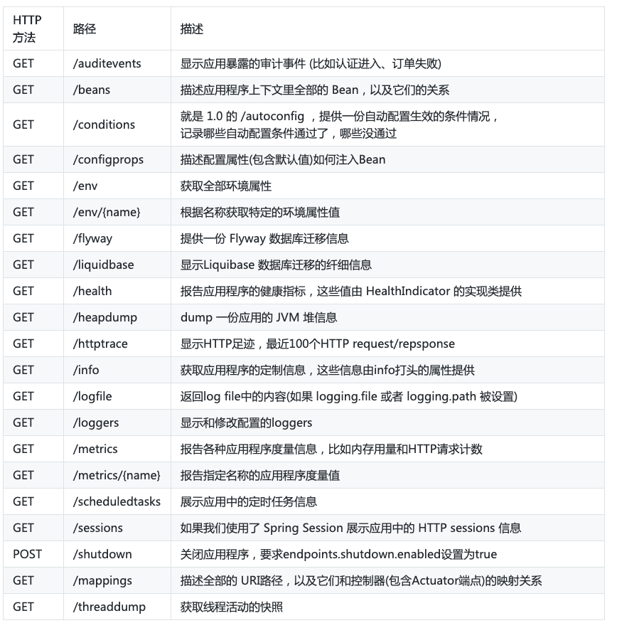

# Java + Spring Boot 应用引入 Prometheus 监控

## 参考
- [SLS时序监控实战: Spring Boot应用监控最佳实践](https://developer.aliyun.com/article/770726)
- [prometheus命令_Prometheus监控告警详解——实战篇](https://blog.csdn.net/weixin_39945531/article/details/112356295)
## java 应用修改

### pom 添加依赖
#### Spring Boot Actuator
Spring Boot作为最主流的Java Web框架, 自然也少不了对监控的支持, 那就是Actuator, 要使用Actuator需要先添加依赖:
```
<dependency>
    <groupId>org.springframework.boot</groupId>
    <artifactId>spring-boot-starter-actuator</artifactId>
    <version>${actuator.version}</version>
</dependency>
```
Actuator默认提供了13个接口:


这些接口默认只开放了/heath和/info, 可以修改配置打开其他的接口:
```
management:
  endpoints:
    web:
      exposure:
        include: '*'
```

#### micrometer registry prometheus
在Spring Boot 2.0以上, 它使用了micrometer作为底层的度量工具, micrometer是监控度量的门面, 相当于slf4j在日志框架中的作用,它能支持按照各种格式来暴露数据, 其中就有Prometheus.
```
<!-- https://mvnrepository.com/artifact/io.micrometer/micrometer-core -->
<dependency>
    <groupId>io.micrometer</groupId>
    <artifactId>micrometer-core</artifactId>
    <version>${micrometer.version}</version>
</dependency>
```
需再额外引入一个很小的依赖来暴露Prometheus数据(**注意**：micrometer-registry-prometheus 和 micrometer-core 版本尽量保持一致):
```
<!-- https://mvnrepository.com/artifact/io.micrometer/micrometer-registry-prometheus -->
<dependency>
    <groupId>io.micrometer</groupId>
    <artifactId>micrometer-registry-prometheus</artifactId>
    <version>${micrometer.version}</version>
</dependency>
```
这个依赖的作用就是会开启一个endpoint, 输出兼容Prometheus exporter的结果, 方便Prometheus来采集
同时记得修改spring boot配置:
```
spring:
  application:
    name: spring-security-demo-simple
management:
  endpoints:
    web:
      exposure:
        include: 'prometheus' # 暴露/actuator/prometheus
  metrics:
    tags:
      application: ${spring.application.name} # 暴露的数据中添加application label
```
启动应用, 访问http://<ip>:<port>/actuator/prometheus 应该会得到监控数据

### spring-security-demo-simple 应用完整配置信息
```
server:
  port: 80

logging:
  level:
    root: INFO
spring:
  security:
    user:
      name: user
      password: 123
  application:
    name: spring-security-demo-simple
management:
  endpoints:
    web:
      exposure:
        include: '*'
  metrics:
    export:
      prometheus:
        enabled: true
    tags:
      application: ${spring.application.name}
  endpoint:
    health:
      enabled: true

info:
  status: Running
  app: ${spring.application.name}
```

### 构建镜像
执行一下命令构建镜像 `spring-security-demo-simple:v1`
```
$ source build-docker-image.sh
```

### 在 k8s 集群运行应用并监控 
在 k8s 集群应用 `spring-security-demo-simple.yml`
```
kubectl apply -f spring-security-demo-simple.yml --record
```
说明: java 应用默认部署在 dev 命名空间，kube-prometheus-stack 部署在 monitoring 命名空间，需修改在自己对应的命名空间

### 查看应用是否被监控
在 Prometheus Targets 和 Configuration 查看应用的监控和配置是否生效

### 在 grafana 导入应用监控的 dashboard 
- 选择+ -> Import -> 粘贴 `12856`
- 选择创建的Prometheus数据源, 即可导入,